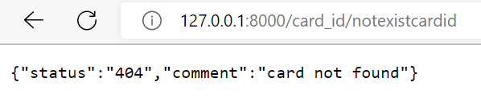

# Cipher SereneForest

## Resume
In this git I want to show an example of information scrapping, use of SQL language with python and backend with FastAPI.

 - [x] SQLite: Create the database 'cipher_fireemblem.db' with 3 relational table:
    - [x] Table of every card with them information ( name, imageurl, class, cost, etc.). 
    - [x] Table of every skil associated with a card.
    - [x] Table of every affinities associated with a card.

 - [x] Scrapper:  Save information of website  https://wiki.serenesforest.net in the SQL table.
    - [x] Visit every hero page. 
    - [x] Debug cards with bad information.

 - [x] FastAPI: Create and API with [FastAPI](https://fastapi.tiangolo.com/)
    - [x] Get endpoint with card all card information 
    

## TODO
 - [ ] Create and TelegramBot and deploy.